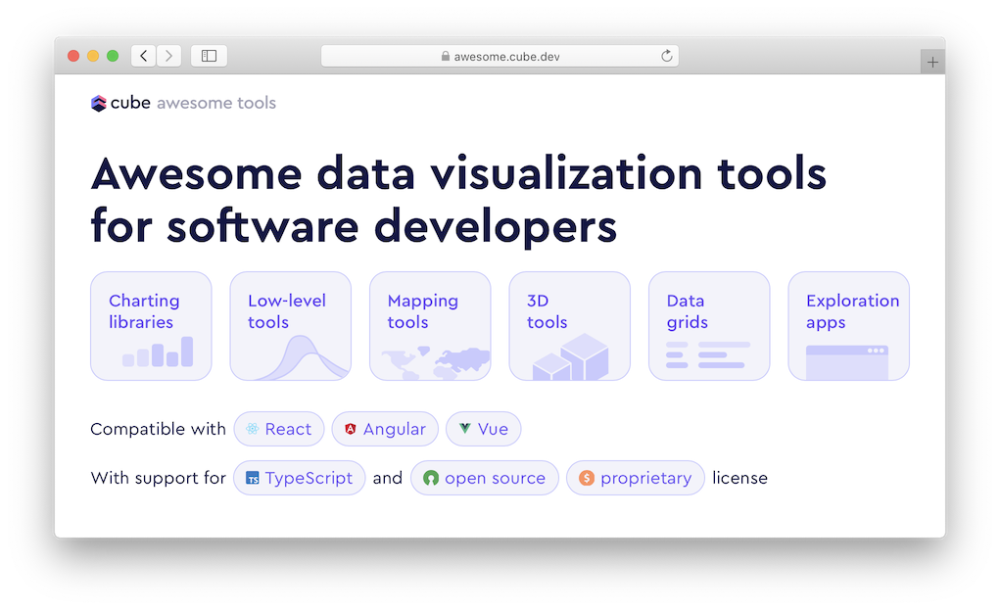

<h1><a href='https://awesome.cube.dev'>awesome.cube.dev</a> — charts, data grids, maps, etc.</h1>

Choose the best tool for you needs by type, framwork, language, or license. Get started in an instant!

<h2>Description</h2>

This web-application is a collection of 61+ front-end data analysis tools for application developers. Limit your search by the type of tool, framework, license, rendering, or a combination of any of categories!

This project was primarily developed by Javascript to allow maximized interaction between the user and the application. SCSS and CSS were both used to style the engaging UI.

<h2>How to Use</h2>

Simply click on the filter(s) you want to apply and scroll down to find a list of applicable tools. Unclick to de-select. After finding a tool best-sutied for your interests, click on it and you will be taken to a page containing its Github repository, website, statisitcs (ie. stars, open issues, contributors, and last release date). There will also be a gallery picturing data visualizations the tool created!

<h3>Tools:</h3>
<ol>
  <li>Charting libraries: create various charts (ie. bar, line, flow)</li>
  <li>Low-level tools: create data visualizations & graphics from data</li>
  <li>Mapping tools: create maps to various scales and with various levels of interactivity</li>
  <li>Data grids: create a grid to organize data</li>
  <li>3D tools: used when working in the 3rd dimension</li>
  <li>Exploration apps: visualize and explore different conclusions from data</li>
</ol>

<h3>Frameworks/Languages:</h3>
<ul>
  <li>React</li>
  <li>Angular</li>
  <li>Vue</li>
  <li>Svelte</li>
</ul>

<h3>Licenses:</h3>
<ul>
  <li>TypeScript</li>
  <li>Open Source</li>
  <li>Proprietary</li>
</ul>

<h3>Rendering:</h3>
<ul>
  <li>Canvas</li>
  <li>SVG</li>
  <li>HTML</li>
</ul>

<h2>License</h2>

MIT License

Copyright (C) 2021 Cube Dev, Inc.

<h2>Website & Make a Suggestion</h2>

Visit [awesome.cube.dev](https://awesome.cube.dev) or suggest an [improvement](https://github.com/cube-js/awesome-tools/issues).

